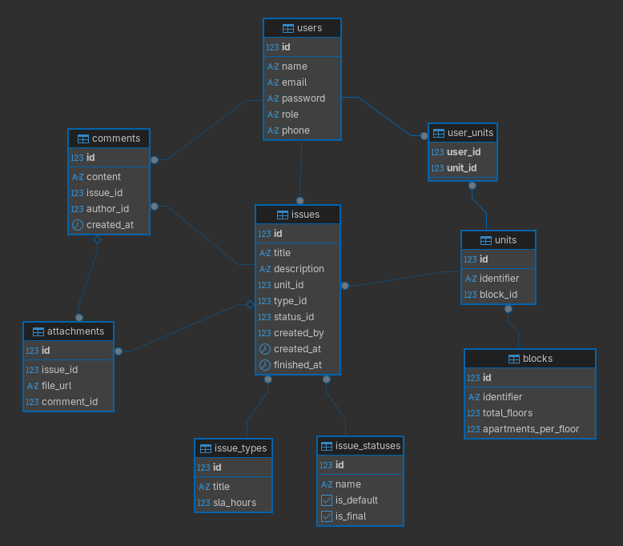

# SGCC - Sistema de Gerenciamento de Chamados para Condomínios

O SGCC é uma aplicação web desenvolvida para otimizar a comunicação e o acompanhamento de manutenções e ocorrências numa
infraestrutura condominial.

---

## 1. Visão Geral e Funcionalidades Principais

O sistema utiliza um controle de acesso baseado em cargos. Ele divide a interação em perfis de usuários com diferentes privilégios:

* **Administradores:** Têm controle total do sistema. Podem cadastrar a infraestrutura (blocos e unidades), gerenciar 
perfis de moradores, vincular moradores aos seus respectivos apartamentos, além de criar tipos e status personalizados de chamados com prazos de SLA (prazo máximo de resolução).
* **Moradores:** Só podem abrir chamados e visualizar ocorrências referentes às unidades habitacionais às quais foram previamente vinculados pela administração. Também podem acompanhar o status dos chamados, interagir via comentários e anexar arquivos (imagens/documentos) para facilitar na comunicação e resolução dos problemas.
* **Colaboradores:** Ao nível de sistema, possuem as mesmas permissões dos moradores além de poderem alterar o status de um chamado.

---

## 2. Processo de Desenvolvimento e Decisões Técnicas

A arquitetura do sistema foi desenhada com foco em resiliência, desempenho e segurança. As principais decisões técnicas incluem:

* **Arquitetura Monolítica com Spring MVC:** Utilização do padrão Model-View-Controller tradicional. O *Backend* foi construído em Java 21 com Spring Boot, enquanto o *Frontend* utiliza Server-Side Rendering com JSP, JSTL e estilização via Bootstrap 5.
* **Estratégia de Pré-alocação vs. Geração Virtual:** Optou-se pelo pré-registro físico de todas as unidades no banco de dados no momento da criação do bloco, em vez de uma abordagem de geração virtual, onde se verificaria se um identificador bate com as propriedades do bloco (número de andares e quantidade de unidades por andar). A geração automática permite que uma unidade seja identificada da seguinte forma: `nome_do_bloco-número_do_andar-número_do_apartamento` (ex: `Bloco A-4-05` identifica o apartamento 5 do 4º andar do Bloco A). Essa decisão prioriza a integridade referencial e a consistência de relatórios, permitindo que moradores e chamados vinculem-se diretamente a chaves estrangeiras reais. Isso elimina a necessidade de lógicas complexas de "verificar e criar" em cada interação e facilita consultas SQL para métricas de ocupação e histórico de ocorrências. Além de facilitar a escalabilidade do sistema com novos atributos para a entidade [`Unit`](./src/main/java/com/desafiodunnas/sgcc/domain/Unit.java) (como metragem, número de quartos, etc.).
* **Processamento Assíncrono com Inserção em Lote:** A criação de um bloco pode envolver a geração simultânea de milhares de unidades habitacionais, uma vez que o total gerado é o produto matemático de `andares * apartamentos`. Para evitar timeouts na interface do usuário e proteger a memória RAM do servidor, a lógica de geração de unidades no [`BlockService`](./src/main/java/com/desafiodunnas/sgcc/service/BlockService.java) foi delegada para uma *thread* secundária utilizando `@Async` e o salvamento no banco de dados foi particionado em lotes.
* **Segurança e Blindagem de Rotas:** O `Spring Security` protege todas as rotas da aplicação. As senhas são criptografadas utilizando `BCrypt`. Foram implementadas defesas tanto no front quanto no backend, garantindo que validações (como impedir um admin de alterar o próprio nível de acesso ou impedir que moradores editem status de chamados) ocorram simultaneamente na interface, com bloqueio visual, e no backend, com lançamento de exceções.
* **Versionamento de Banco de Dados:** A adoção do `Flyway` garante que todas as migrações estruturais do banco de dados sejam aplicadas de maneira determinística, eliminando o risco de inconsistências entre os ambientes de desenvolvimento e produção.
* **Consultas Otimizadas (JPQL):** Para a barra de pesquisa de chamados, em vez de depender de múltiplos filtros no frontend, desenvolveu-se uma consulta relacional robusta através do [`IssueRepository`](./src/main/java/com/desafiodunnas/sgcc/repository/IssueRepository.java). Isso permite buscar termos livremente entre entidades associadas (autor, status, tipo, unidade) mantendo, simultaneamente, o isolamento lógico dos dados para moradores.
* **Infraestrutura Automatizada com Docker:** O ambiente de desenvolvimento e produção é padronizado através do Docker, garantindo que o sistema seja executado de maneira consistente em qualquer máquina local ou servidor. O `docker-compose.yml` orquestra tanto o serviço Spring Boot quanto o banco de dados PostgreSQL, simplificando a inicialização e a gestão do ambiente.
* **Volume Docker para Persistência de Anexos:** Para garantir que os arquivos de mídia e documentos anexados aos chamados sejam preservados mesmo após a reinicialização dos contêineres, foi configurado um volume Docker específico para armazenar esses arquivos, localizado no diretório [`/uploads`](./uploads). Isso assegura que os dados críticos relacionados aos chamados não sejam perdidos, mantendo a integridade e a continuidade do serviço.

---

## 3. Descrição do Modelo de Dados (Diagrama Relacional)

A modelagem do banco de dados PostgreSQL foi desenhada visando integridade referencial. Abaixo segue o diagrama relacional e uma breve descrição das entidades e seus relacionamentos:



* **`users`**: Armazena as credenciais e dados pessoais como nome, email, senha criptografada, telefone e cargo; está relacionado a `user_units` para vincular moradores às suas unidades habitacionais, visto que é possível que um usuário seja morador de mais de uma unidade; também se relaciona com `issues` e `comments` para registrar a autoria dos chamados e interações.
* **`issues`**: Entidade central de chamados. Possui um título, texto descritivo, uma unidade, tipo (ex: `Manutenção`), status (ex: `Em Aberto`, `Finalizado`), autor e datas de criação e finalização. Também possui relação com comentários (`comments`) e anexos (`attachments`) para armazenar o histórico de interações e arquivos relacionados a cada chamado.
* **`blocks`**: Representa uma infraestrutura física do condomínio. Possui um nome, total de andares e quantidade de apartamentos por andar. Está relacionado a `units`, onde cada unidade é vinculada a um bloco específico.
* **`units`**: Representa o apartamento físico, dependente de um bloco. Possui um nome (ex: `Bloco A-4-05`), e está relacionado a `issues` para registrar os chamados abertos naquela unidade, e a `user_units` para vincular os moradores que residem naquela unidade.
* **`user_units`**: Tabela associativa (N:N) que vincula os moradores às suas unidades habitacionais.
* **`issue_types`**: Tabela de parametrização de SLAs. Cada tipo de chamado pode ter um prazo de resolução diferente, em horas.
* **`issue_statuses`**: Tabela de parametrização de estados do chamado. Um status pode ser padrão ou de conclusão.
* **`comments`**: Histórico de interações num chamado. Cada comentário possui um autor, texto e data de criação, e está relacionado a um chamado específico. Também pode ter anexos relacionados.
* **`attachments`**: Armazena URLs de arquivos de mídia/documentos. Pode pertencer à abertura do chamado ou a um comentário específico.

---

## 4. Estrutura de Pastas e Organização do Código
A estrutura do projeto segue as convenções do Spring Boot, organizada em camadas para promover a separação de responsabilidades e facilitar a manutenção:

```
sgcc/
├── docs/                         # Documentação adicional
├── src/
│   ├── main/
│   │   ├── java/com/desafiodunnas/sgcc/
│   │   │   ├── component/                  # Componentes de inicialização
│   │   │   ├── config/                     # Configurações do Spring
│   │   │   ├── controller/                 # Camada de controladores (Endpoints MVC e APIs REST)
│   │   │   ├── domain/                     # Camada de domínio (Entidades JPA mapeadas no banco)
│   │   │   ├── repository/                 # Camada de persistência (Interfaces Spring Data JPA)
│   │   │   ├── security/                   # Regras de autenticação e autorização (Spring Security)
│   │   │   └── service/                    # Camada de regras de negócio
│   │   │
│   │   ├── resources/
│   │   │   ├── db/migration/               # Scripts de versionamento do banco de dados
│   │   │   └── application*.properties     # Configurações de variáveis por ambiente (default, dev, prod)
│   │   │
│   │   └── webapp/WEB-INF/jsp/
│   │       ├── admin/              # Views restritas para administradores (blocos, status, usuários)
│   │       ├── issues/             # Views do ciclo de vida de chamados (listagem, formulários)
│   │       ├── error.jsp           # Página genérica para tratamento visual de exceções
│   │       ├── index.jsp           # Dashboard inicial
│   │       └── login.jsp           # Tela de autenticação
│   │
│   └── test/                   # Contexto de testes unitários e de integração
│
├── uploads/                    # Diretório mapeado como volume para armazenamento local de anexos
├── docker-compose.yml          # Orquestração local de contêineres
├── Dockerfile                  # Configuração de construção da imagem Docker da aplicação
├── pom.xml                     # Gerenciamento de dependências
├── render.yaml                 # Blueprint para o deploy no Render
└── README.md                   # Documentação principal do projeto
```

---

## 5. Instruções para Execução do Projeto

Siga os passos abaixo para compilar e executar o projeto em sua máquina local utilizando a infraestrutura automatizada.

### 5.1. Pré-requisitos
* **Git**.
* **Docker e Docker Compose**.

### 5.2. Clonagem do Repositório
Clone o repositório do projeto para sua máquina local utilizando o comando:
```bashgit
git clone https://github.com/Afonso017/sgcc.git
```

### 5.3. Preparação do Ambiente
Antes de iniciar os serviços, é necessário configurar as variáveis de ambiente locais que não são rastreadas pelo controle de versão:
* **Variáveis de Ambiente**: Certifique-se de criar o arquivo `.env` na raíz do projeto para conter as variáveis de ambiente de conexão do banco de dados de sua preferência, necessárias para o funcionamento do sistema. Essas variáveis serão automaticamente injetadas no ambiente do contêiner Docker durante a execução do Compose.

Utilize o seguinte modelo como referência:

```properties
DB_NAME=
DB_USERNAME=
DB_PASSWORD=
```

### 5.4. Execução Via Compose
A aplicação utiliza o Docker Compose para orquestrar tanto o servidor Spring Boot quanto o banco de dados PostgreSQL. Ao executar o comando de inicialização, o sistema realiza automaticamente o *build* da imagem, provisiona o banco com as tabelas e migrações estruturais do Flyway e disponibiliza o serviço.

Na raiz do projeto, execute:
```bash
docker compose up --build
```

### 5.5. Acesso e Credenciais Iniciais
Após a conclusão do log de inicialização, o sistema estará pronto para receber conexões. O componente [`AdminSeeder`](./src/main/java/com/desafiodunnas/sgcc/component/AdminSeeder.java) garante a criação de um acesso inicial caso a base de usuários esteja vazia, além da criação de tipos e status de chamados básicos.

* **URL de Acesso**: `http://localhost:8080`
* **Email do Administrador**: `admin@gmail.com`
* **Senha**: `admin123`

---

## 6. Deploy em Produção

O sistema encontra-se hospedado e disponível para acesso público através da plataforma **Render**, utilizando uma arquitetura baseada em contêineres Docker para o serviço web e um banco de dados relacional isolado.

* **URL de Acesso:** [https://sgcc-app.onrender.com](https://sgcc-app.onrender.com)

### 6.1. Comportamentos do Ambiente Gratuito
Como o projeto está utilizando a infraestrutura gratuita do Render para fins de portfólio e demonstração, existem comportamentos específicos do ambiente que devem ser observados durante o uso:

* **Hibernação:** O servidor entra em modo de hibernação após 15 minutos de inatividade. Caso acesse o sistema enquanto ele estiver adormecido, o primeiro carregamento da tela de login pode demorar 50 segundos ou mais. Após o aquecimento, a navegação flui normalmente.
* **Armazenamento de Arquivos:** O plano gratuito não fornece volumes de disco persistentes. Atualmente, os anexos enviados nos chamados são armazenados no sistema de arquivos local do contêiner. Isso significa que, em caso de um novo deploy ou reinicialização do servidor após a hibernação, os arquivos físicos de mídia poderão ser perdidos, resultando em erro ao tentar abri-los, embora os registros textuais do chamado permaneçam intactos no banco de dados.
* **Persistência de Dados:** O banco de dados opera de forma independente do servidor web e seus dados são mantidos com segurança, não sendo afetados pelas reinicializações do servidor. Porém, possui validade de 90 dias.
